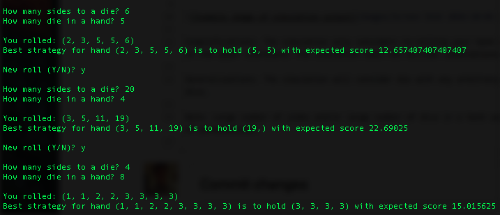

# Yahtzee Move Planner
Simulates a turn of Yahtzee and recommends which dice to hold to maximize score on upper section of the Yahtzee score card.

Yahtzee is a dice rolling game with the goal of creating various combinations and earning the highest ending score. Each turn, the player rolls five dice, with two optional opportunities to re-roll some or all (or none) of the dice. The player then chooses a combination that roll qualifies for, calculates a score accoridng to the rules for that combo, and adds it to the player's running total. The players each get 13 turns to earn points toward the 13 official combos, only scoring points once toward any one combo.

The 13 combinations a player can earn points for are divided between the upper and lower sections of the scorecard. The lower section combos are generally poker-themed, such as three-of-a-kind, full house, and (large and small) straight. The upper section meanwhile is devoted to combinations based on one of the sides of the die and are scored by the sum of the instances of that side. For instance, a roll of (4, 4, 5, 5, 5) could qualify for 8 points toward the Fours combination or 15 points toward the Fives category. <a href="https://en.wikipedia.org/wiki/Yahtzee">Find out more about Yahtzee (Wikipedia)</a>

This project simulates a turn of Yahtzee and recommends which die to hold before re-rolling for the best chance of earning the most points. 

Simplifications: The simulation only considers re-rolling your hand once. The simulation only considers scores earned toward combinations on the upper scorecard. The simulation does not exclude combinations that have already been satisfied. 

Generalizations: The simulation will consider die with any arbitrary number of sides. The simulation will consider any arbitrary number of dice. 

Note: Large number of sides and/or large number of dice in a hand can lead to long wait times while the program iterates through so many of permutations.
